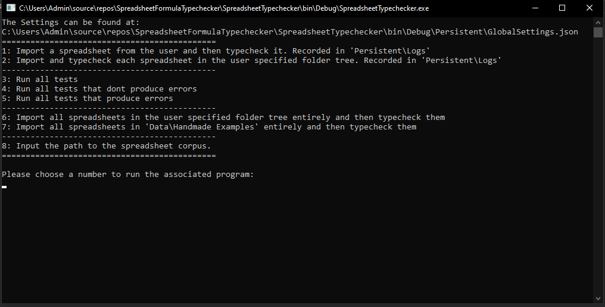
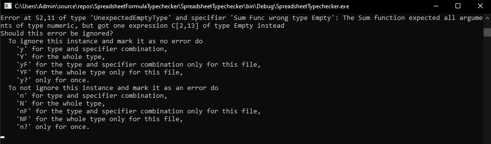

# Type-Checking of Formulas in Spreadsheet Programs

This project is a combination of 2 applications, with the SpreadsheetTypechecker application being the main focus of a thesis named "Type-Checking of Formulas in Spreadsheet Programs" by me (Nikas Kolbe), as well as ResultHandler, an auxilliary application to preprocess the Log data from the first application and convert it into csv files.

## SpreadsheetTypechecker

### Program Start
The application starts with following screen:

Programs 1 and 2 are the main features of this application. In program 1, a single spreadsheet will be imported and typechecked, while in program 2, a folder will be deep-searched for any spreadsheets, which in turn each get imported and typechecked. Supported spreadsheets are all spreadsheet formats used by Microsoft Excel. The Log will be extended as each spreadsheet has been checked by the typechecker.

Programs 3 to 5 invoke testruns for the application. 3 invokes all tests, 4 only the positive ones and 5 only the negative ones. Tests are specified in the folder "Testsuite" in this project. They are split between folders "Good" and "Bad" with "Good" being the tests invoked by program 4 and "Bad" being the ones invoked by program 5. The tests are written in the language specified in the thesis and in file "Spreadsheet.g4".

Programs 6 and 7 invoke first the importer and then the typechecker on a group of spreadsheets. Program 6 runs on a user-specified folder (with deep-search), and program 7 runs on the folder "Data\Handmade Examples" in the project folder (only shallow-search).

With Program 8, the user-specified folder can be reset once it was already specified by the user, as it is saved for future reference in a settings file.

### Error Handling
Once the typechecker reaches an error, the following screen will be shown.

The typechecker saves error occurences in a settings file to not ask the user again when the same error is found at a later point. To guide this error handling, a number of commands can be made, as seen in this picture. These commands decide how future occurences will be handled.

## ResultHandler
The ResultHandler asks for the folder the logs are kept in at startup. The logs from the SpreadsheetTypechecker are saved in the subfolder "Persistent/Logs" in the folder the executable is run in, so this should generally be the path that should be input here. The handler then combines each log together into one entity, preprocesses the data and then puts it into multiple csv files representing different groupings of data.